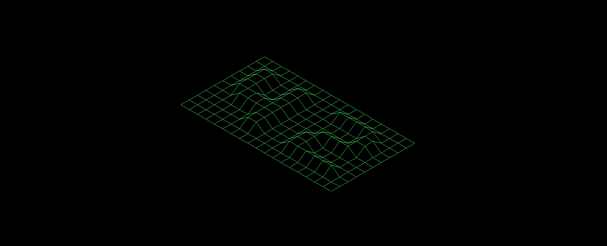

# FDF - WIREFRAME

This project consists to create a graphical representation of a land by wireframe("Fil De Fer - FDF" in french) by connecting different points (x, y, z) by segments.
The land will be stocked in a file passed in parameters.

### Installing

Take a look to `Minilibx/README.md` to install `Minilibx`

Clone the project

```
git clone https://github.com/BABAK0T0/FDF
```


Then execute Makefile to create an executable

```
make re
```

### Running

An executable is available in deposit, if you can't `make` the Makefile

```
chmod u+x fdf
```

Choose a map in folder "maps" to print or create an other with ".fdf" extenstion

```
./fdf maps/example.fdf
```

### Events

| KEYS | DESCRIPTION |
| --- | --- |
| <kbd>ESC</kbd> | Exit the program |
| <kbd>ARROWS</kbd> | Move map(x,y) |
| <kbd>+</kbd> | Zoom + |
| <kbd>-</kbd> | Zoom - |
| <kbd>Page up</kbd> | Move map(z+) |
| <kbd>Page down</kbd> | Move map(z-) |
| <kbd>C</kbd> | Random color |

### Example



### Built With

* [Minilibx] - The framework for graphical user interface development made by [42](https://www.42.fr/)

